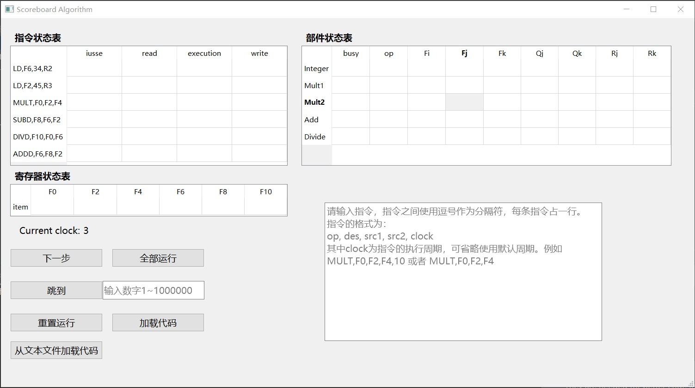
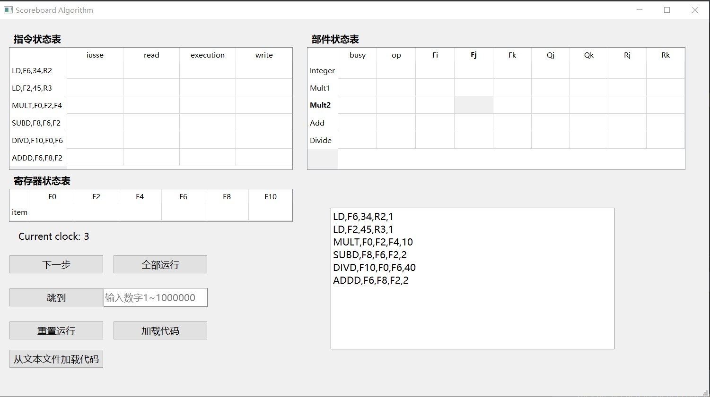

# 记分牌算法
## 界面
  

## 环境
> python 3.6  
> PyQt5

## TO DO
- [x] 编写基础算法实现代码调度  
- [x] 编写界面实现从多种方式加载代码（文本文件or直接输入）  
- [x] 编写界面实现单步运行、多步运行、重置代码  
- [ ] 完善readme文件  
- [ ] 编写代码实现真正意义上的计算，可以得到运算后的结果（从寄存器中观察即可）  
- [ ] 写注释  
- [ ] 优化代码，修补bug（待续~）  